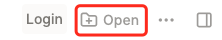

- This project is created in Logseq, and hosted as a static website.
- To get a better use experience, you may need to access these content via website or import it into online logseq.
	- Open website: https://cloud-native-tutorials-anddd7.vercel.app/
	- Open via logseq (editable)
		- Clone this repo `git clone https://github.com/Anddd7/cloud-native-tutorials`
		- Enter https://logseq.com/
		- Click 'Open a local folder'
			- -> Click 'Open' in top-left menu
			  
				- -> Select the repo
		- Explore and Enjoy~